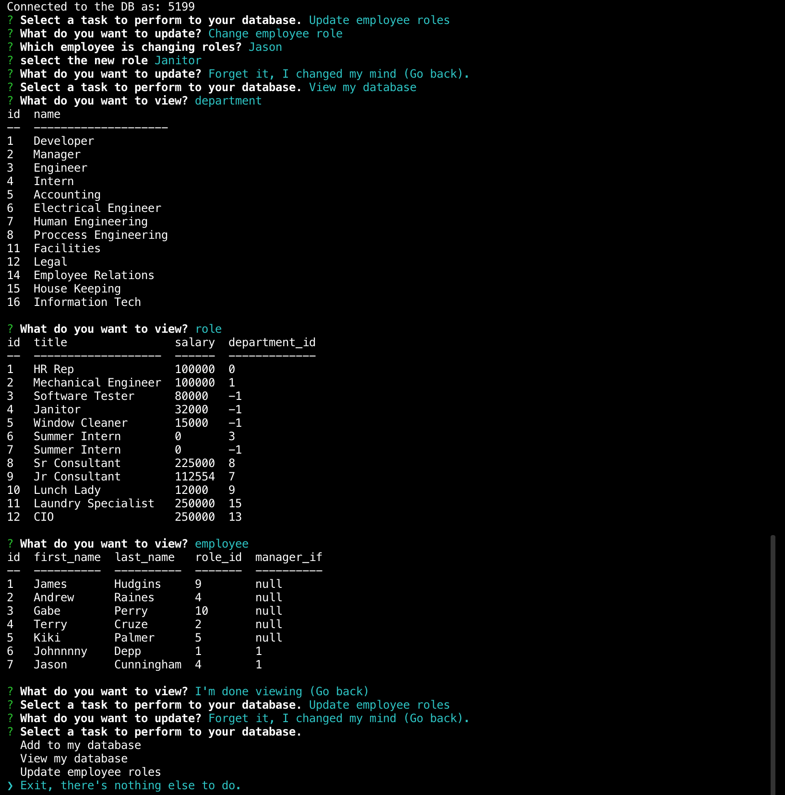

# Employee Management Database
  ## Description
  Node.js CLI application used for managing a company's employees using node, inquirer, and MySQL.
  ### Table of contents
  1. [Description](#Description)
  2. [Installation](#Installation)
  3. [Usage](#Usage)
  4. [License](#License)
  5. [Contributing](#Contributing)
  6. [Tests](#Tests)
  7. [Questions](#Questions)

  ## Installation
  Enter the following in your terminal (must have github installed):
  ```
  $ git clone https://github.com/Unbukn/Employee_Tracker_5000.git
  ```
  Configure your DB connection as follows:
  ```
  var connection = mysql.createConnection({
  host: "Your DB hostname",
  port: 3306,
  user: "Your Username",
  password: "Your Password",
  database: "employeeDB_db"
});
```

  ## Usage

  ## Video Demo (Click to view)
  [](https://youtu.be/WZwt28gV3aU)

  ## License
No lic information available
  ## Contributing
  James Hudgins   
  ## Tests
 No tests for this repo
  ## Questions
  Questions regarding this application should be sent via email to, james.hudgins.work@gmail.com
